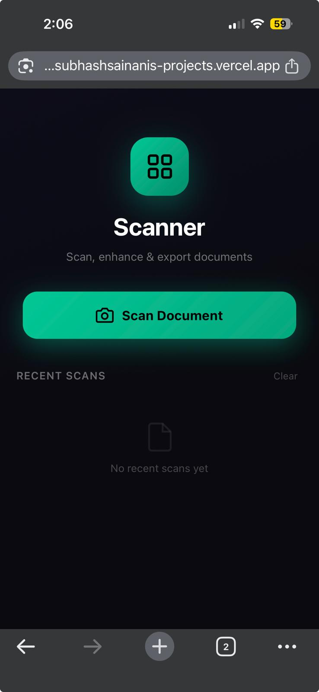
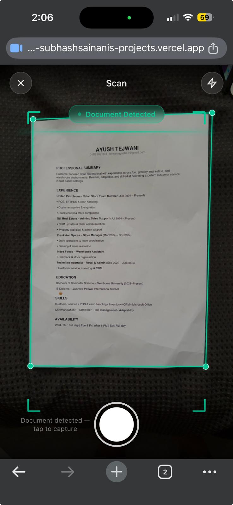
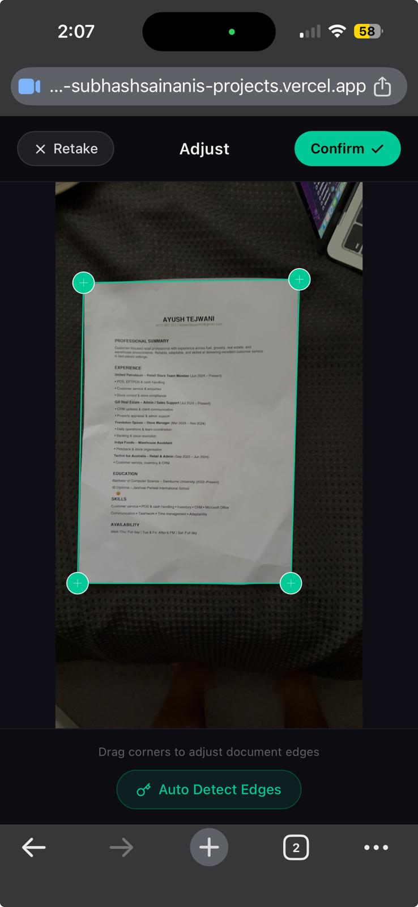
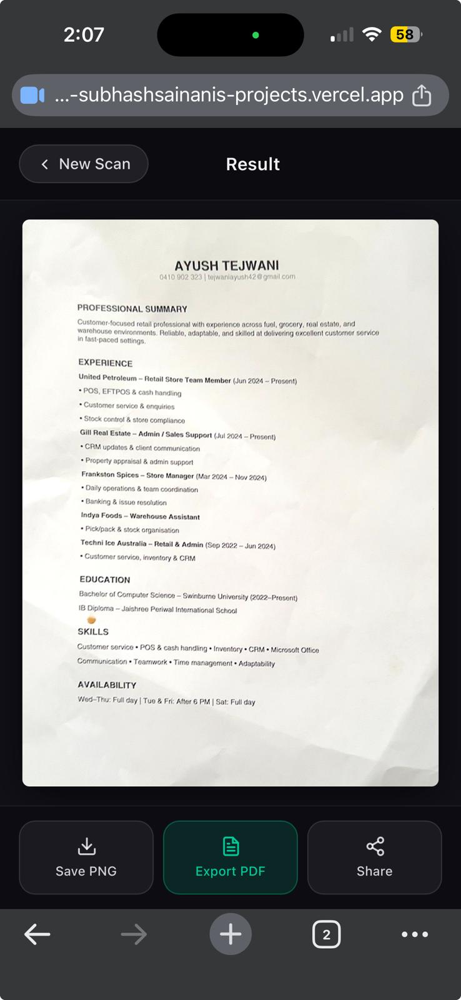
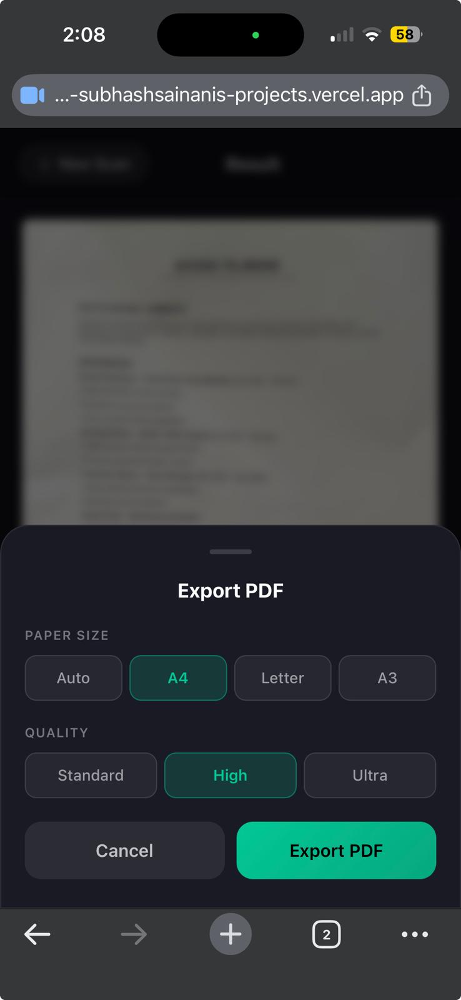
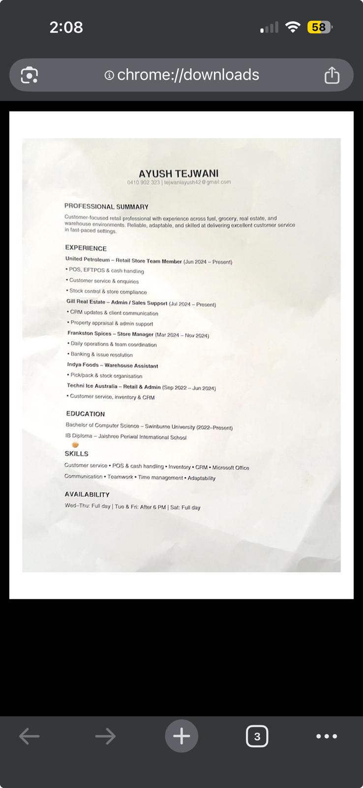

# Document Scanner

A mobile-friendly, browser-based document scanner with real-time edge detection, perspective correction, and PDF export — no server required.

Built with Vanilla TypeScript, Vite, and OpenCV.js.

---

## Features

- **Live Edge Detection** — Real-time document boundary detection every 250ms via OpenCV.js
- **Perspective Correction** — Automatic four-corner warp to produce a flat, straight scan
- **Color Output** — True-color scans with automatic brightness/contrast enhancement and sharpening
- **Corner Fine-Tuning** — Drag each corner with a magnifier lens for pixel-perfect adjustment
- **PDF Export** — Export scans as PDF with paper size options (Auto / A4 / A3 / Letter) and quality levels (Standard / High / Ultra)
- **PNG Download** — Save scans as full-resolution PNG images
- **Web Share API** — Native share sheet on supported mobile browsers
- **Recent Scans** — Last 4 scans stored locally in the browser via localStorage
- **PWA Support** — Installable on home screen; works offline after first load
- **Zero Dependencies at Runtime** — OpenCV.js and jsPDF loaded from CDN; no backend

---


## Screenshots

| Home Screen | Camera View | Corner Adjust | Result | Export | Output |
|-------------|-------------|---------------|--------|--------|--------|
|  |  |  |  |  |  |

---

## Browser Support

| Browser | Supported |
|---------|-----------|
| Chrome 88+ (Android/Desktop) | Yes |
| Safari 15.4+ (iOS/macOS) | Yes |
| Firefox 90+ | Yes |
| Edge 88+ | Yes |
| Samsung Internet 14+ | Yes |

**Camera API** (`getUserMedia`) and **Canvas 2D** are required. All modern mobile and desktop browsers support these.

---

## Mobile Support

Optimised for portrait mobile use. Tested on:

- iPhone (iOS 15+) — Safari
- Android (Chrome 88+)
- iPad (Safari)

---

## Local Development

### Prerequisites

- [Node.js](https://nodejs.org/) 18 or higher
- [npm](https://npmjs.com/) 9 or higher (or pnpm / yarn)

### Install & Run

```bash
# Clone or extract the project
cd document-scanner

# Install dependencies
npm install

# Start development server
npm run dev
```

Open `http://localhost:5173` in your browser.

> On mobile, you can access the dev server on your local network via the IP address shown in the terminal (e.g. `http://192.168.x.x:5173`).

---

## Production Build

```bash
# Type-check and build for production
npm run build

# Preview the production build locally
npm run preview
```

The built files are output to `dist/`. These are static files — serve them from any static host.

---

## Project Structure

```
document-scanner/
├── public/
│   ├── favicon.svg        # App icon
│   ├── manifest.json      # PWA manifest
│   ├── robots.txt         # SEO robots file
│   └── sw.js              # Service worker (offline support)
├── src/
│   ├── main.ts            # All app logic (camera, OpenCV, UI, export)
│   └── style.css          # All styles
├── index.html             # Entry point
├── package.json
├── tsconfig.json
├── vite.config.ts
├── README.md
└── DEPLOYMENT.md
```

---

## Deployment

See [DEPLOYMENT.md](./DEPLOYMENT.md) for step-by-step deployment guides for GitHub Pages, Vercel, and Netlify.

---

## Technology Stack

| Layer | Technology |
|-------|------------|
| Language | Vanilla TypeScript |
| Build tool | Vite |
| Computer vision | OpenCV.js (CDN) |
| PDF generation | jsPDF (CDN) |
| Storage | Browser localStorage |
| PWA | Service Worker + Web App Manifest |

---

## License

MIT — free to use, modify, and distribute.
